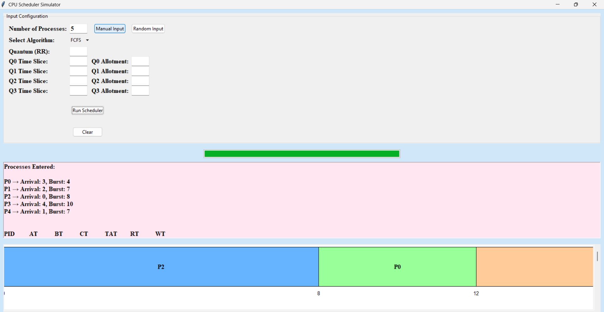

**# cpu-scheduler-gui
Python GUI tool for simulating CPU scheduling algorithms like FCFS, SJF, SRTF, Round Robin, and MLFQ with Gantt chart visualization.**

# CPU Scheduler Simulator (Python + Tkinter)

A graphical simulation of CPU scheduling algorithms implemented using Python's `tkinter` GUI toolkit. This tool allows users to visualize, compare, and analyze various CPU scheduling techniques like **FCFS**, **SJF**, **SRTF**, **Round Robin**, and **MLFQ**.

##  Features

**Supports 5 Scheduling Algorithms:**
FCFS, SJF (Non-preemptive), SRTF (Preemptive), Round Robin, MLFQ

**Input Options:**
Manual input or randomized process generation

**Output Includes:**

Gantt chart (with queue level in MLFQ)

Detailed process table (PID, AT, BT, CT, TAT, RT)

Average Turnaround Time (TAT) and Response Time (RT)

**Algorithm Behaviors:**

Round Robin: Custom time slice

MLFQ: Multiple levels, custom quantum & allotments, dynamic demotion

**Utility Features:**

Cross-platform screen clearing

Reset function for process reuse

Menu-driven, user-friendly interface

**Purpose:**
Ideal for simulating, testing, and comparing CPU scheduling algorithms in an educational or project setting.

## Algorithms Overview

Algorithm	Description

FCFS	Processes are scheduled in order of arrival.

SJF	Non-preemptive. Selects process with the shortest burst time available.

SRTF	Preemptive version of SJF. Picks the process with the shortest remaining time.

Round Robin	Processes get equal CPU time (quantum). Useful for time-sharing systems.

MLFQ	Multi-level queues with decreasing priorities. Each queue uses different quantum.

## Sample Input

P0 → Arrival: 3, Burst: 4

P1 → Arrival: 2, Burst: 7

P2 → Arrival: 0, Burst: 8

P3 → Arrival: 4, Burst: 10

P4 → Arrival: 1, Burst: 7

## Expected Output

**FCFS (First-Come, First-Served)**

PID	AT	BT	CT	TAT	RT	WT

0  	3  	4  	26	23	19	19

1  	2  	7  	22	20	13	13

2  	0  	8  	8  	8  	0  	0

3 	4  	10	36	32	22  22

4  	1  	7  	15	14	7  	7

Average Turnaround Time: 19.40

Average Response Time: 12.20

Average Waiting Time: 12.20

**SJF (Shortest Job First)**

PID	AT	BT	CT	TAT	RT	WT

0  	3  	4  	12  9  	5  	5

1  	2  	7  	19	17	10	10

2  	0  	8  	8  	8  	0  	0

3  	4  	10	36	32	22	22

4  	1  	7  	26	25	18	18

Average Turnaround Time: 18.20

Average Response Time: 11.00

Average Waiting Time: 11.00

**SRTF (Shortest Remaining Time First)**

PID	AT	BT	CT	TAT	RT	WT

0  	3  	4  	7  	4  	0  	0

1  	2  	7  	19	17	10	10

2  	0  	8  	12	12	0  	4

3  	4  	10	36	32	22	22

4  	1  	7  	26	25	18	18

Average Turnaround Time: 18.00

Average Response Time: 10.00

Average Waiting Time: 10.80

**⏱️ Round Robin (Quantum = 3)**

PID	AT	BT	CT	TAT	RT	WT

0  	3  	4  	25	22	6  	18

1  	2  	7  	32	30	4  	23

2  	0  	8  	27	27	0  	19

3  	4  	10	36	32	11	22

4  	1  	7  	31	30	2  	23

Average Turnaround Time: 28.20

Average Response Time: 4.60

Average Waiting Time: 21.00

**MLFQ (Quanta: Q1=1,3 , Q2=1,4 , Q3=1,5 , Q4=1,6)**

PID	AT	BT	CT	TAT	RT	WT

0  	3  	4  	19	16	2	12

1  	2  	7  	31	29	1	22

2  	0  	8  	33	33	0	25

3  	4  	10	36	32	3	22

4  	1  	7  	30	29	0	22

Average Turnaround Time: 27.80

Average Response Time: 1.20

Average Waiting Time: 20.60

## Screenshots
**FCFS** 

**SJF**

**SRTF**

**RR**

**MLFQ**

## Known Issues / Limitations

-No GUI (command-line only).

-SJF assumes non-preemptive implementation.

-No priority-based scheduling implemented.

-MLFQ is limited to 4 levels (can be expanded).

-No persistent logging of results (output only to screen).

## Team Members & Contributions

**Name	                           Role**

Martina Calledo      	Round Robin/MLFQ Logic

Jasmine Omandam 	  	FCFS/SJF/SRTF Logic

## Requirements

Python + Tkintr

## Run the app:

-bashh

python cpu_scheduler_gui.py
