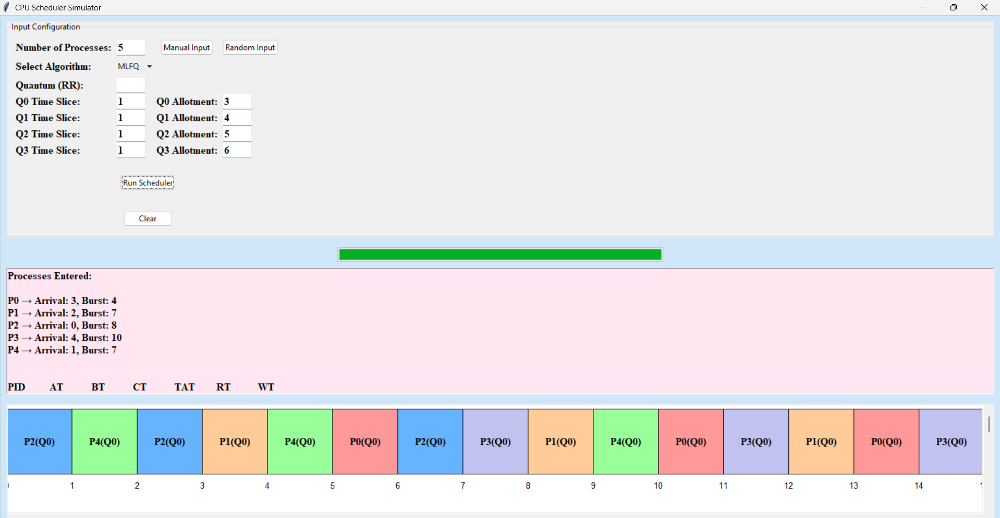

**# cpu-scheduler-gui
Python GUI tool for simulating CPU scheduling algorithms like FCFS, SJF, SRTF, Round Robin, and MLFQ with Gantt chart visualization.**

# CPU Scheduler Simulator (Python + Tkinter)

A graphical simulation of CPU scheduling algorithms implemented using Python's `tkinter` GUI toolkit. This tool allows users to visualize, compare, and analyze various CPU scheduling techniques like **FCFS**, **SJF**, **SRTF**, **Round Robin**, and **MLFQ**.

##  Features

- Intuitive graphical user interface (GUI)
- Manual or random process input
- Gantt chart visualization
- Performance metrics:
  - Completion Time (CT)
  - Turnaround Time (TAT)
  - Response Time (RT)
  - Averages of TAT and RT
- Supports 5 algorithms:
  - First-Come First-Served (FCFS)
  - Shortest Job First (SJF)
  - Shortest Remaining Time First (SRTF)
  - Round Robin (with customizable quantum)
  - Multi-Level Feedback Queue (MLFQ)

## Algorithms Overview
Algorithm	Description
FCFS	Processes are scheduled in order of arrival.
SJF	Non-preemptive. Selects process with the shortest burst time available.
SRTF	Preemptive version of SJF. Picks the process with the shortest remaining time.
Round Robin	Processes get equal CPU time (quantum). Useful for time-sharing systems.
MLFQ	Multi-level queues with decreasing priorities. Each queue uses different quantum.

## Sample Input

PID	Arrival	Burst
P0	2	8
P1	2	4
P2	1	6
P3	2	9
P4	1	8

## Expected Output

**FCFS (First-Come, First-Served)**
PID	AT	BT	ST	CT	TAT	RT
P2	1	6	1	7	6	0
P4	1	8	7	15	14	6
P0	2	8	15	23	21	13
P1	2	4	23	27	25	21
P3	2	9	27	36	34	25
Average TAT: 20.00
Average RT: 13.00

**SJF (Shortest Job First)**
PID	AT	BT	ST	CT	TAT	RT
P2	1	6	1	7	6	0
P1	2	4	7	11	9	5
P4	1	8	11	19	18	10
P0	2	8	19	27	25	17
P3	2	9	27	36	34	25
Average TAT: 18.40
Average RT: 11.40

**SRTF (Shortest Remaining Time First)**
PID	AT	BT	ST	CT	TAT	RT
P2	1	6	1	11	10	0
P1	2	4	2	6	4	0
P0	2	8	11	19	17	9
P4	1	8	19	27	26	18
P3	2	9	27	36	34	25
Average TAT: 18.20
Average RT: 10.40

**⏱️ Round Robin (Quantum = 3)**
PID	AT	BT	CT	TAT	RT
P2	1	6	19	18	0
P4	1	8	31	30	3
P0	2	8	33	31	5
P1	2	4	26	24	8
P3	2	9	36	34	11
Average TAT: 27.4
Average RT: 5.4

**🧮 MLFQ (Quanta: Q1=3, Q2=5, Q3=3, Q4=5)**
PID	AT	BT	CT	TAT	RT
P2	1	6	19	18	0
P4	1	8	24	23	3
P0	2	8	29	27	5
P1	2	4	30	28	8
P3	2	9	36	34	11
Average TAT: 26.0
Average RT: 5.4

## Screenshots
**FCFS** 

**SJF**

**SRTF**

**RR**

**MLFQ**



## Known Issues / Limitations
-GUI may lag with more than ~20 processes.
-No process priority support (for now).
-MLFQ fixed to 4 levels only.
-No persistent save/load for process sets.


## Team Members & Contributions
**Name	                           Role**
Martina Calledo      	UI Design,Round Robin/MLFQ Algorithms
Jasmine Omandam 	  	UI Design, FCFS/SJF Logic


## Requirements

- Python 3.x
- `tkinter` (usually included with Python)

## Run the app:

```bash
python scheduler_gui.py
